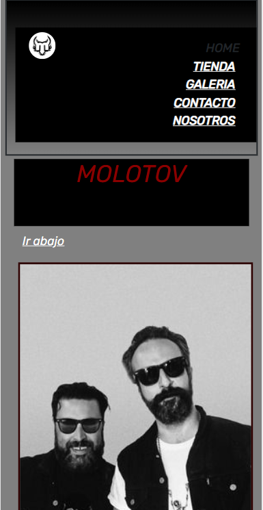
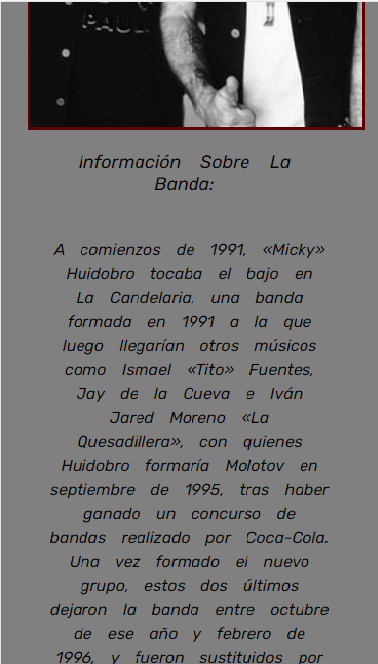
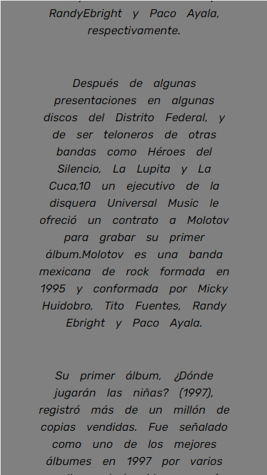
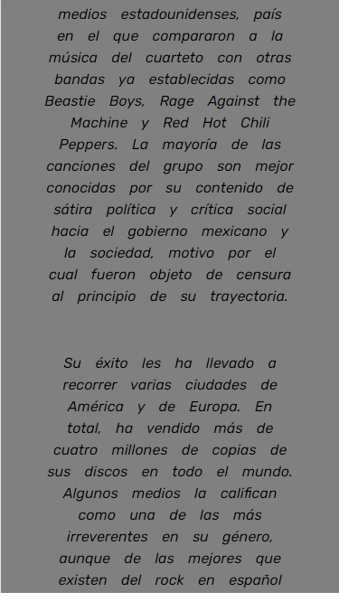
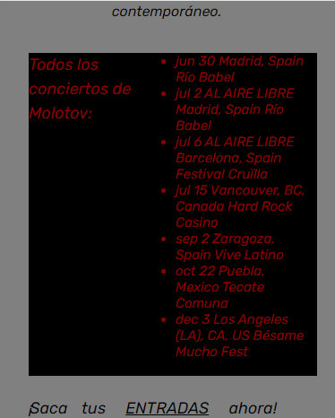
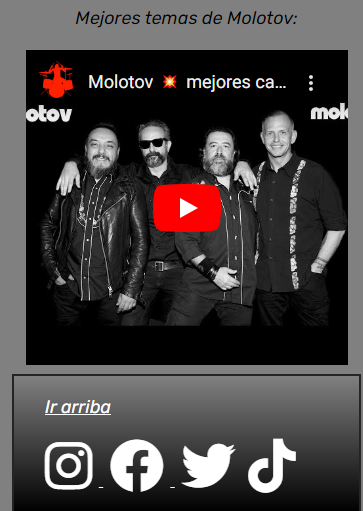

<h1> Molotov Pagina Web </h1>

 Este es un repositorio para el curso de Desarrollo Web de CoderHouse 

<h2> Herramientas Utilizadas</h2>

 HTML5 y CSS3, Flexbox, Bootstrap, Scss, entra otras 

<h3> Vista Previa Iphone SE (375x667)

<h4> Pda: Las capturas fueron previas al cambio de banner" <h4>
<h5> Autor: Catriel Alvarez <h4>

